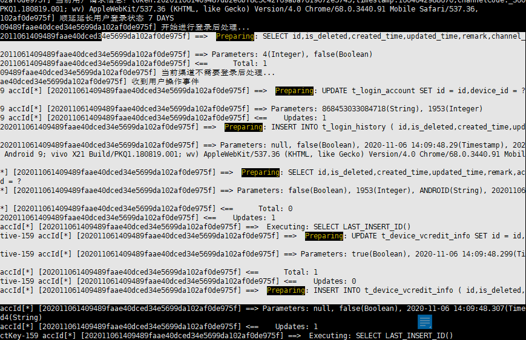
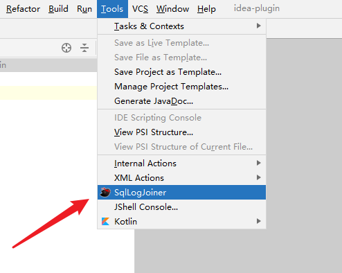

     
     
    <b>这是一个用于将Mybatis输出的Sql日志进行参数占位符自动替换的插件</b>
     
     

Mybatis依靠其易用性和拓展性在JavaWeb开发领域占据了重要市场，Mybatis可以输出Sql日志但它将预编译模板和参数分开输出。      
线下开发或线上排查问题过程中需要根据其日志复原Sql并手工执行用于调试调优很不方便。    
为了能输出输出完整的Sql语句，一般有如下的解决方案：
1. 利用Mybatis的插件拓展，选择合适的拦截点捕捉Sql模板和参数，拼接输出。
2. 利用Agent Instrumentation Api代理JDBC相关接口，拦截合适的方法捕捉Sql模板和参数，拼接输出。
3. 不修改或侵入目标系统，使用外部工具对Sql日志进行解析拼接。

上述方式1和方式2主要问题在于对Sql日志进行了全量处理，而我们平时线上线下开发调试过程中只是偶尔有需求。   
为了偶尔零星的需求而增加系统额外的负载，性价比显然是不高的。

本插件采用了方案3，使用者将需要选中复制待解析的statement行和parameter行到系统粘贴板，    
点击插件按钮触发系统粘贴板的读取、解析、并重新复制到粘贴板。

本插件已经发布到Jetbrains MarketPlace,点击 [这里](https://plugins.jetbrains.com/plugin/15339) 查看。   

# 使用方法

1. 将包含Mybatis输出的Sql日志Ctrl+C到粘贴板(可包含多条sql)
2. 点击Tool->SqlLogJoiner或Toolbar上最后一个按钮SqlLogJoiner
3. 粘贴板中已经有解析好的完整Sql,Ctrl+V复制到需要的位置即可

# 原理
1. 从系统粘贴板中读取待处理的Sql日志
2. 解析、转换得到完整Sql
3. 将完整Sql重新设置到粘贴板供粘贴使用

Mybatis每次执行Sql会输出三行日志,各行日志中关键字按顺序为:**Preparing**、**Parameters**、**Total**。     
第1步中复制原始日志中至少要包含一条**Preparing**日志。       
本插件按行读取粘贴板中的字符串,依次循环读取**Preparing**日志和**Parameters**日志、两两组队、解析参数、拼接Sql、复制到粘贴板。

# 使用截图
## 选择合适的日志复制

## 点击触发插件处理

